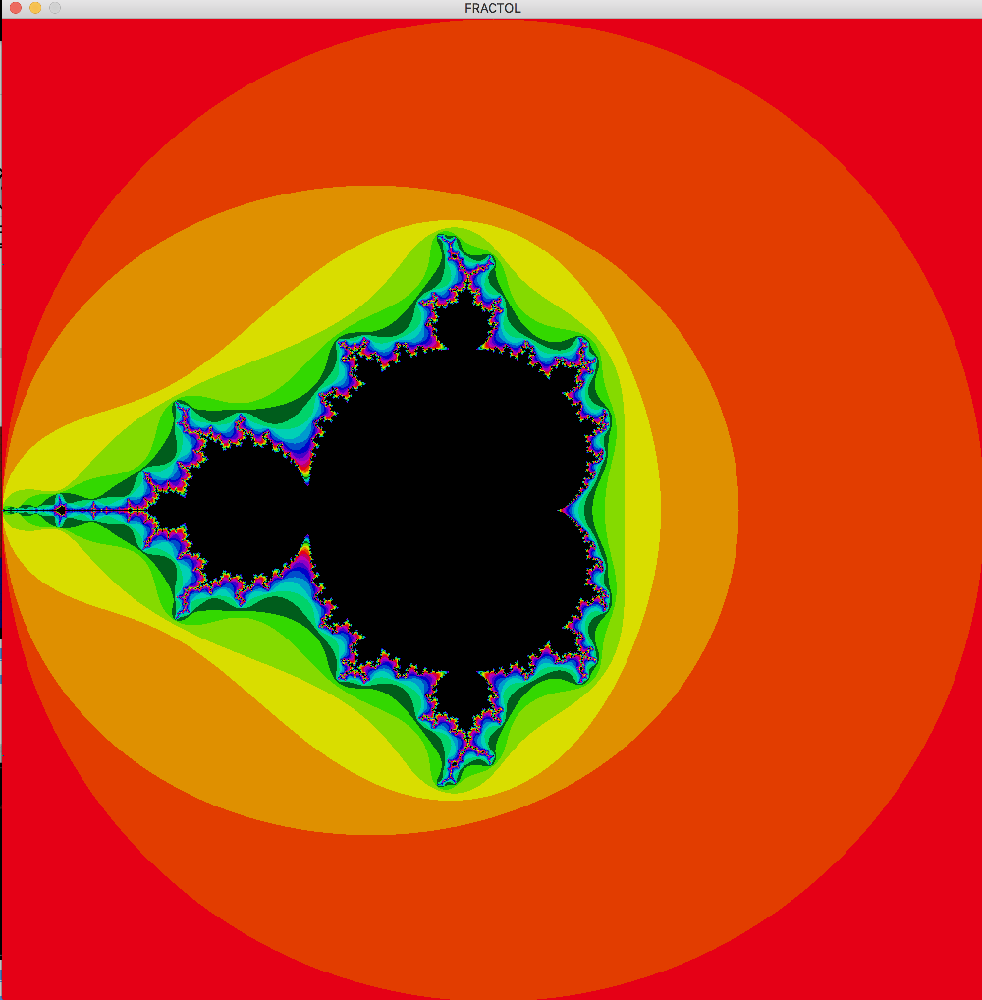

# Fractol

Classic fractal recreation in C.
* Implimented miltithreading using pthread library for drawing in 4 sections.
* Added color schemes using numpad 1-4.
* Incorporated the ability to increase complexity/iterations via "+/-" keys.
* 'c' key for changing colors.




# Usage

```console
make
./fractol <1-3>
```
